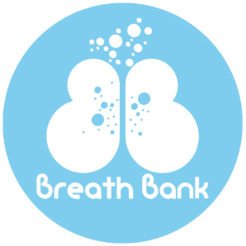

# BreathBank 
**BreathBank** es una herramienta para que todo tipo de usuarios se beneficien de las ventajas de la práctica de la respiración consciente. **Mejora de la capacidad pulmonar, reducción del estrés y la ansiedad** al alcance de la mano. **BreathBank y dale un respiro a tu vida**.

  

## Beneficios de la respiración consciente
- 🫁 Mejora de las capacidades pulmonar y respiratoria.
- 🧘‍♂️ Disminución del estrés y de la ansiedad.
- 😌 Reducción de la irascibilidad y mejora del descanso nocturno.
- ❤️ Mejora en las funciones cardíaca, circulatoria y digestiva.
- 🧠 Aumento de la claridad mental y de la capacidad de concentración.
   
## Herramientas de desarrollo y lenguaje de programación
- 🚀 **Framework de desarrollo**: Flutter
- 🔥 **Plataforma de backend**: Firebase
- 💻 **Lenguaje de desarrollo**: Dart

## Estado del proyecto
🚧 En desarrollo – Se siguen añadiendo funcionalidades y mejoras.

## Información del proyecto
Este proyecto se ha llevado a cabo como parte de un Trabajo de Fin de Grado de la Universidad de Burgos.

## Demo
Puedes probar una demo online de BreathBank de 3 minutos sin ningún tipo de descarga en el siguiente enlace:  
👇  
[Demo online de BreathBank](https://appetize.io/app/b_4zmloqjccli6hvpvr7qbqmutme)

## Contenidos

## Aplicación
Aplicación para dispositivos Android.

## Autor 
Eduardo García de Leániz Juarros

